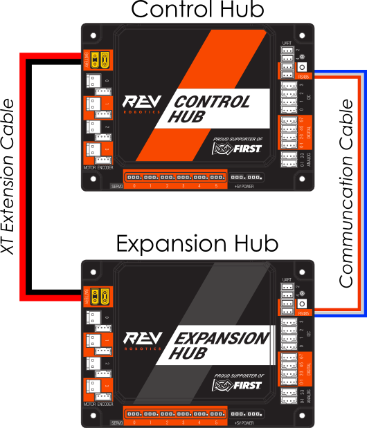
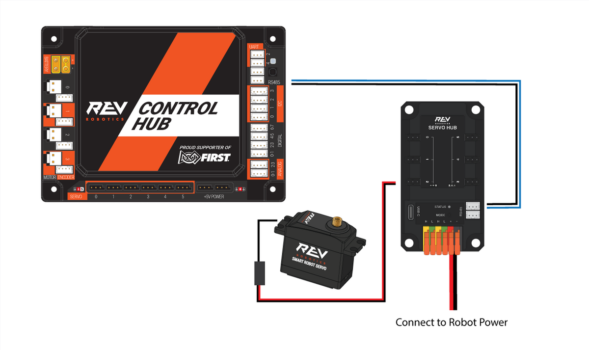

# St. Mark's FTC Biobuzz Repo For Team 23381 "The Marksmen"

## ADB connect instructions

if `adb devices` doesn't show any devices:
1. close and reopen Android Studio
2. connect to driver hub using Wi-Fi
3. run `adb kill-server && adb start-server`
4. run `adb connect 192.168.43.1`
5. now try `adb devices`

it may take a second for the control hub to show up in Android Studio

# hardware map

driver station config name: `v0`

## control hub

### I²C ports/buses

| port/bus  | device type                  | location                    | verbatim name |
|:----------|:-----------------------------|-----------------------------|:--------------|
| `0`       | *unused*                     | *unused*                    | *unused*      |
| `1`       | Pinpoint Odo Computer        | left side under control hub | `odo`         |
| `2`       | *unused*                     | *unused*                    | *unused*      |
| `3`       | *unused*                     | *unused*                    | *unused*      |

### digital ports

| port  | device type    | location               | verbatim name           |
|:------|:---------------|------------------------|:------------------------|
| `0`   | *unused*       | *unused*               | *unused*                |
| `1`   | *unused*       | *unused*               | *unused*                |
| `2`   | *unused*       | *unused*               | *unused*                |
| `3`   | *unused*       | *unused*               | *unused*                |
| `4`   | *unused*       | *unused*               | *unused*                |
| `5`   | *unused*       | *unused*               | *unused*                |
| `6`   | *unused*       | *unused*               | *unused*                |
| `7`   | *unused*       | *unused*               | *unused*                |
| `8`   | *unused*       | *unused*               | *unused*                |

### USB ports

| port    | device       | verbatim name |
|:--------|:-------------|:--------------|
| USB 3.0 | Limelight 3A | `limelight`   |

ensure Limelight is plugged into `USB 3.0`, not `USB 2.0`

after scanning, the Limelight will show up as `Ethernet Device` under the USB devices, make sure to rename it to the verbatim name

make sure to save the config with the Limelight under a new name, as scanning may delete other devices

### DC motors

| motor port  | motor type              | verbatim name | encoder? |
|:------------|-------------------------|:--------------|:---------|
| `0`         | GoBILDA 5202/3/4 series | `frontLeft`   | ❌        |
| `1`         | GoBILDA 5202/3/4 series | `frontRight`  | ❌        |
| `2`         | GoBILDA 5202/3/4 series | `backLeft`    | ❌        |
| `3`         | GoBILDA 5202/3/4 series | `backRight`   | ❌        |

make sure to connect every motor with the correct polarity; the reversing is done in software

### servos

| servo port   | servo type       | verbatim name |
|:-------------|------------------|:--------------|
| `0`          | *unused*         | *unused*      |
| `1`          | *unused*         | *unused*      |
| `2`          | *unused*         | *unused*      |
| `3`          | *unused*         | *unused*      |
| `4`          | *unused*         | *unused*      |
| `5`          | *unused*         | *unused*      |

## expansion hub

### connection method (ports matter)

### I2C ports/buses

| port/bus | device type            | location       | verbatim name         |
|:---------|:-----------------------|----------------|:----------------------|
| 0        | *unused*               | *unused*       | *unused*              |
| 1        | *unused*               | *unused*       | *unused*              |
| 2        | *unused*               | *unused*       | *unused*              |
| 3        | *unused*               | *unused*       | *unused*              |

### DC motors

| motor port   | motor type | verbatim name | encoder?  |
|:-------------|------------|:--------------|:----------|
| `0`          | *unused*   | *unused*      | ❌         |
| `1`          | *unused*   | *unused*      | ❌         |
| `2`          | *unused*   | *unused*      | ❌         |
| `3`          | *unused*   | *unused*      | ❌         |

## servo hub

### connection method (ports matter)

### servos

| servo port   | servo type | verbatim name   |
|:-------------|------------|:----------------|
| `0`          | *unused*   | *unused*        |
| `1`          | *unused*   | *unused*        |
| `2`          | *unused*   | *unused*        |
| `3`          | *unused*   | *unused*        |
| `4`          | *unused*   | *unused*        |
| `5`          | *unused*   | *unused*        |

# controller map

## sticks

### left stick

- **X**: move robot left/right
- **Y**: move robot forwards/back

the **start** button toggles between robot/field centric control

### right stick:

- **X**: rotate clockwise/counterclockwise
- **Y**: *unused*

## bumpers

- **left bumper**: *unused*
- **right bumper**: *unused*

## triggers

- **left trigger**: slow mode
- **right trigger**: *unused*

## buttons

### face buttons
- **A**: *unused*
- **B**: *unused*
- **Y**: *unused*
- **X**: *unused*

### d-pad
- **up**: *unused*
- **down**: *unused*
- **left**: *unused*
- **right**: *unused*

### other buttons
- **start**: toggle field/robot centric
- **back**: reset field centric heading
    - make sure to orient the robot towards the top of the field (in between the goals)

# OpModes

## TeleOp
- `Enable/Disable Panels`: enables/disables [Panels telemetry](http://192.168.43.1:8001/)
- `BlueTeleOp`: TeleOp for blue team
- `RedTeleOp`: TeleOp for red team

## Auto

### blue team

- `BlueAuto`: starting by bottom triangle

### red team

- `RedAuto`: starting by bottom triangle

## Tuner

- `Test`: TBD

# vision

We are using a Limelight 3A

## pipelines

| filename        | index  | allowed tag IDs | purpose                                       |
|:----------------|--------|:----------------|:----------------------------------------------|
| *unused*        | `0`    | *unused*        | *unused*                                      |

pipeline files are saved in the [limelight folder](limelight/)

# telemetry IPs

- Panels: [192.168.43.1:8001](http://192.168.43.1:8001)
- robot controller: [192.168.43.1:8080](http://192.168.43.1:8080/)
- Limelight video stream: [192.168.43.1:5800](http://192.168.43.1:5801/)
- Limelight control: [192.168.43.1:5801](http://192.168.43.1:5800/)
